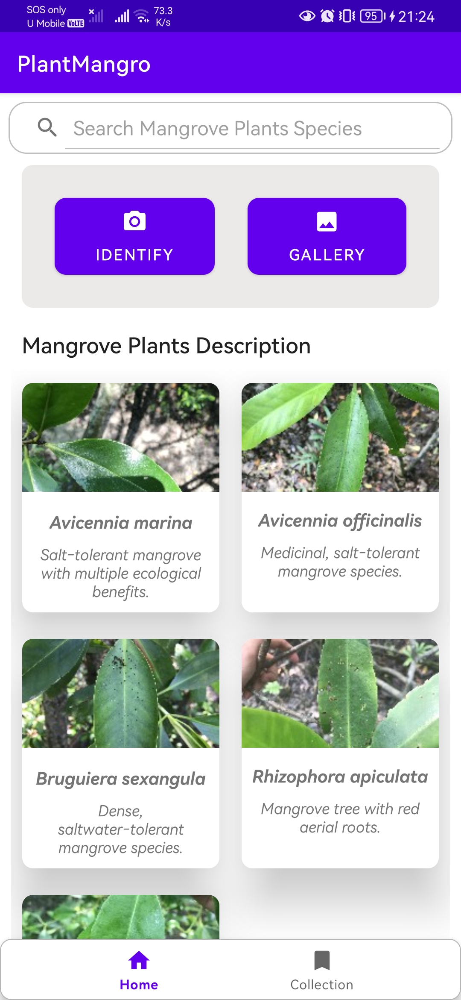

# Mangrove Plant Identification Mobile Application 

  

The MangroveID is a powerful tool for mangrove plant enthusiasts that can help identify the species of a leaf just by taking a photo.

The app uses deep learning algorithms and image processing techniques to accurately predict the species of the leaf. The app is developed using the Kotlin programming language in Android Studio, which provides a user-friendly interface and seamless functionality. Once the app is installed on the user's mobile device, it can access the device's camera to capture an image of the leaf.

The captured image is then processed using the app's built-in deep learning model, which has been trained on a small dataset of leaf images from various plant species by using transfer learning. The model used in this app is pretrained VGG16 model as feature extractor and fully-connected layer with Softmax activation function as the classifer. The programming language that used to develop the prediction model is Python.

The features such as Camera/Gallery, Prediction, Specially-designed share card, Mangrove Plant Species Description are available in PlantMamgro. The app provides users with the predicted scientifc name, along with a Wikipedia link and a high-quality image of the plant. The users are allowed to share their findings with friends via social media with our specially-designed sharing card which contain the photo of the plant and a quote related to mangrove plants.

The MangroveID is designed to be user-friendly and accessible in coastal/ forest region (No internet connection is needed). It has a simple and intuitive interface, making it easy to use even for those with no prior experience in plant identification. Overall, the MangroveID app is an essential tool for anyone interested in plant identification, providing accurate and reliable species predictions with just a click of a button.
